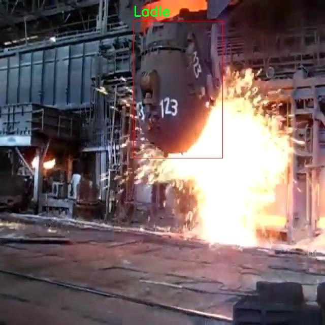

### 1.背景意义

研究背景与意义

在现代钢铁生产过程中，钢水包作为重要的运输和储存工具，其安全性和有效性直接影响到生产效率和产品质量。随着工业自动化和智能化的不断发展，传统的人工监测方法已无法满足高效、精准的生产需求。因此，基于计算机视觉的钢水包检测系统应运而生，成为提升钢铁生产安全性和自动化水平的重要手段。

YOLO（You Only Look Once）系列目标检测算法因其高效性和实时性，在工业视觉检测领域得到了广泛应用。YOLOv11作为该系列的最新版本，结合了更为先进的特征提取和目标定位技术，能够在复杂的工业环境中实现快速、准确的目标检测。然而，针对钢水包的检测任务，现有的YOLOv11模型仍存在一定的局限性，如对特定环境下的光照变化、背景杂乱等因素的适应性不足。因此，改进YOLOv11模型以适应钢水包检测的特定需求，具有重要的研究价值和实际意义。

本研究所使用的数据集包含440张经过标注的钢水包图像，数据集的单一类别“Ladle”集中体现了钢水包在钢铁生产中的关键角色。通过对该数据集的深入分析和模型训练，旨在提升YOLOv11在钢水包检测任务中的性能，确保其在不同环境条件下的稳定性和准确性。此外，研究还将探讨数据预处理和模型优化的有效策略，以进一步提高检测系统的鲁棒性和适应性。

综上所述，基于改进YOLOv11的钢水包检测系统不仅能够为钢铁生产提供实时监测和预警，还将推动智能制造技术的发展，为行业的数字化转型提供有力支持。通过本研究的实施，期望能够为钢铁行业的安全生产和高效管理提供新的解决方案，促进工业自动化水平的提升。

### 2.视频效果

[2.1 视频效果](https://www.bilibili.com/video/BV1joUJYjEWY/)

### 3.图片效果


##### [项目涉及的源码数据来源链接](https://kdocs.cn/l/cszuIiCKVNis)**

注意：本项目提供训练的数据集和训练教程,由于版本持续更新,暂不提供权重文件（best.pt）,请按照6.训练教程进行训练后实现上图演示的效果。

### 4.数据集信息

##### 4.1 本项目数据集类别数＆类别名

nc: 1
names: ['Ladle']


该项目为【目标检测】数据集，请在【训练教程和Web端加载模型教程（第三步）】这一步的时候按照【目标检测】部分的教程来训练

##### 4.2 本项目数据集信息介绍

本项目数据集信息介绍

本项目所使用的数据集专注于钢铁生产过程中关键设备——钢水包（Ladle）的检测与识别。数据集的主题围绕“steel plant ladle”，旨在为改进YOLOv11模型提供高质量的训练数据，以提升其在实际应用中的检测精度和效率。该数据集包含丰富的钢水包图像，涵盖了不同角度、光照条件和背景环境下的钢水包实例，确保模型能够在多样化的场景中有效识别和定位目标。

数据集中仅包含一个类别，即“Ladle”，这意味着所有的标注数据均聚焦于钢水包的检测。这一单一类别的设计使得模型能够专注于优化对钢水包的识别能力，减少了多类别干扰带来的复杂性。通过精心挑选和标注的数据，数据集不仅涵盖了钢水包的标准外观，还包括了在不同操作条件下的变体，如满载、空载以及在不同生产阶段的状态。这种多样性为模型的训练提供了充分的样本，使其能够学习到钢水包在各种环境下的特征。

此外，数据集的构建遵循严格的标注标准，确保每一张图像中的钢水包都被准确标记，便于后续的模型训练和评估。通过使用这一数据集，研究团队期望能够显著提高YOLOv11在钢水包检测任务中的性能，进而推动钢铁生产自动化和智能化的发展，为工业应用提供更为高效和可靠的解决方案。整体而言，本项目的数据集为实现高效的钢水包检测系统奠定了坚实的基础。





### 5.全套项目环境部署视频教程（零基础手把手教学）

[5.1 所需软件PyCharm和Anaconda安装教程（第一步）](https://www.bilibili.com/video/BV1BoC1YCEKi/?spm_id_from=333.999.0.0&vd_source=bc9aec86d164b67a7004b996143742dc)


[5.2 安装Python虚拟环境创建和依赖库安装视频教程（第二步）](https://www.bilibili.com/video/BV1ZoC1YCEBw?spm_id_from=333.788.videopod.sections&vd_source=bc9aec86d164b67a7004b996143742dc)

### 6.改进YOLOv11训练教程和Web_UI前端加载模型教程（零基础手把手教学）

[6.1 改进YOLOv11训练教程和Web_UI前端加载模型教程（第三步）](https://www.bilibili.com/video/BV1BoC1YCEhR?spm_id_from=333.788.videopod.sections&vd_source=bc9aec86d164b67a7004b996143742dc)


按照上面的训练视频教程链接加载项目提供的数据集，运行train.py即可开始训练



     Epoch   gpu_mem       box       obj       cls    labels  img_size
     1/200     20.8G   0.01576   0.01955  0.007536        22      1280: 100%|██████████| 849/849 [14:42<00:00,  1.04s/it]
               Class     Images     Labels          P          R     mAP@.5 mAP@.5:.95: 100%|██████████| 213/213 [01:14<00:00,  2.87it/s]
                 all       3395      17314      0.994      0.957      0.0957      0.0843

     Epoch   gpu_mem       box       obj       cls    labels  img_size
     2/200     20.8G   0.01578   0.01923  0.007006        22      1280: 100%|██████████| 849/849 [14:44<00:00,  1.04s/it]
               Class     Images     Labels          P          R     mAP@.5 mAP@.5:.95: 100%|██████████| 213/213 [01:12<00:00,  2.95it/s]
                 all       3395      17314      0.996      0.956      0.0957      0.0845

     Epoch   gpu_mem       box       obj       cls    labels  img_size
     3/200     20.8G   0.01561    0.0191  0.006895        27      1280: 100%|██████████| 849/849 [10:56<00:00,  1.29it/s]
               Class     Images     Labels          P          R     mAP@.5 mAP@.5:.95: 100%|███████   | 187/213 [00:52<00:00,  4.04it/s]
                 all       3395      17314      0.996      0.957      0.0957      0.0845


###### [项目数据集下载链接](https://kdocs.cn/l/cszuIiCKVNis)

### 7.原始YOLOv11算法讲解


##### YOLOv11三大损失函数

YOLOv11（You Only Look Once）是一种流行的目标检测算法，其损失函数设计用于同时优化分类和定位任务。YOLO的损失函数通常包括几个部分：
**分类损失、定位损失（边界框回归损失）和置信度损失** 。其中，

  1. box_loss（边界框回归损失）是用于优化预测边界框与真实边界框之间的差异的部分。

  2. cls_loss（分类损失）是用于优化模型对目标类别的预测准确性的部分。分类损失确保模型能够正确地识别出图像中的对象属于哪个类别。

  3. dfl_loss（Distribution Focal Loss）是YOLO系列中的一种损失函数，特别是在一些改进版本如YOLOv5和YOLOv7中被引入。它的主要目的是解决目标检测中的类别不平衡问题，并提高模型在处理小目标和困难样本时的性能。

##### 边界框回归损失详解

box_loss（边界框回归损失）是用于优化预测边界框与真实边界框之间的差异的部分。


##### box_loss 的具体意义


##### 为什么需要 box_loss

  * 精确定位：通过最小化中心点坐标损失和宽高损失，模型能够更准确地预测目标的位置和大小。
  * 平衡不同类型的目标：使用平方根来处理宽高损失，可以更好地平衡不同大小的目标，确保小目标也能得到足够的关注。
  * 稳定训练：适当的损失函数设计有助于模型的稳定训练，避免梯度爆炸或消失等问题。

##### 分类损失详解

在YOLO（You Only Look
Once）目标检测算法中，cls_loss（分类损失）是用于优化模型对目标类别的预测准确性的部分。分类损失确保模型能够正确地识别出图像中的对象属于哪个类别。下面是关于cls_loss的详细解读：

##### 分类损失 (cls_loss) 的具体意义

  
分类损失通常使用交叉熵损失（Cross-Entropy
Loss）来计算。交叉熵损失衡量的是模型预测的概率分布与真实标签之间的差异。在YOLO中，分类损失的具体形式如下：


##### 为什么需要 cls_loss

  * 类别识别：cls_loss 确保模型能够正确识别出图像中的目标属于哪个类别。这对于目标检测任务至关重要，因为不仅需要知道目标的位置，还需要知道目标的类型。

  * 多类别支持：通过最小化分类损失，模型可以处理多个类别的目标检测任务。例如，在道路缺陷检测中，可能需要识别裂缝、坑洞、路面破损等多种类型的缺陷。

  * 提高准确性：分类损失有助于提高模型的分类准确性，从而提升整体检测性能。通过优化分类损失，模型可以更好地学习不同类别之间的特征差异。

##### 分布损失详解

`dfl_loss`（Distribution Focal
Loss）是YOLO系列中的一种损失函数，特别是在一些改进版本如YOLOv5和YOLOv7中被引入。它的主要目的是解决目标检测中的类别不平衡问题，并提高模型在处理小目标和困难样本时的性能。下面是对`dfl_loss`的详细解读：

##### DFL Loss 的背景

在目标检测任务中，类别不平衡是一个常见的问题。某些类别的样本数量可能远远多于其他类别，这会导致模型在训练过程中对常见类别的学习效果较好，而对罕见类别的学习效果较差。此外，小目标和困难样本的检测也是一个挑战，因为这些目标通常具有较少的特征信息，容易被忽略或误分类。

为了应对这些问题，研究者们提出了多种改进方法，其中之一就是`dfl_loss`。`dfl_loss`通过引入分布焦点损失来增强模型对困难样本的关注，并改善类别不平衡问题。

##### DFL Loss 的定义

DFL Loss
通常与传统的交叉熵损失结合使用，以增强模型对困难样本的学习能力。其核心思想是通过对每个类别的预测概率进行加权，使得模型更加关注那些难以正确分类的样本。

DFL Loss 的公式可以表示为：


##### DFL Loss 的具体意义**

  * **类别不平衡：** 通过引入平衡因子 α，DFL Loss 可以更好地处理类别不平衡问题。对于少数类别的样本，可以通过增加其权重来提升其重要性，从而提高模型对这些类别的检测性能。
  *  **困难样本：** 通过聚焦参数 γ，DFL Loss 可以让模型更加关注那些难以正确分类的样本。当 
  * γ 较大时，模型会对那些预测概率较低的样本给予更多的关注，从而提高这些样本的分类准确性。
  *  **提高整体性能** ：DFL Loss 结合了传统交叉熵损失的优势，并通过加权机制增强了模型对困难样本的学习能力，从而提高了整体的检测性能。


### 8.200+种全套改进YOLOV11创新点原理讲解

#### 8.1 200+种全套改进YOLOV11创新点原理讲解大全

由于篇幅限制，每个创新点的具体原理讲解就不全部展开，具体见下列网址中的改进模块对应项目的技术原理博客网址【Blog】（创新点均为模块化搭建，原理适配YOLOv5~YOLOv11等各种版本）

[改进模块技术原理博客【Blog】网址链接](https://gitee.com/qunmasj/good)


#### 8.2 精选部分改进YOLOV11创新点原理讲解

###### 这里节选部分改进创新点展开原理讲解(完整的改进原理见上图和[改进模块技术原理博客链接](https://gitee.com/qunmasj/good)【如果此小节的图加载失败可以通过CSDN或者Github搜索该博客的标题访问原始博客，原始博客图片显示正常】

### 可扩张残差（DWR）注意力模块
当前的许多工作直接采用多速率深度扩张卷积从一个输入特征图中同时捕获多尺度上下文信息，从而提高实时语义分割的特征提取效率。 然而，这种设计可能会因为结构和超参数的不合理而导致多尺度上下文信息的访问困难。 为了降低绘制多尺度上下文信息的难度，我们提出了一种高效的多尺度特征提取方法，该方法分解了原始的单步特征提取方法方法分为两个步骤，区域残差-语义残差。 在该方法中，多速率深度扩张卷积在特征提取中发挥更简单的作用：根据第一步提供的每个简明区域形式特征图，在第二步中使用一个所需的感受野执行简单的基于语义的形态过滤 一步，提高他们的效率。 此外，扩张率和扩张卷积的容量每个网络阶段都经过精心设计，以充分利用所有可以实现的区域形式的特征图。 因此，我们分别为高层和低层网络设计了一种新颖的扩张式残差（DWR）模块和简单倒置残差（SIR）模块。


首先，该博客引入了一个Dilation-wise Residual（DWR）模块，用于提取网络高层的特征，如图2a所示。多分支结构用于扩展感受野，其中每个分支采用不同空洞率的空洞深度卷积。
然后，专门设计了一个Simple Inverted Residual（SIR）模块来提取网络低层的特征，如图2b所示。该模块仅具有3×3的微小感受野，但使用inverted bottleneck式结构来扩展通道数量，确保更强的特征提取能力。
最后，基于DWR和SIR模块，构建了一个编码器-解码器风格的网络DWRSeg，其中解码器采用了简单的类似FCN的结构。解码器使用来自最后两个阶段的强语义信息直接对特征图进行上采样，然后将它们与来自较低阶段的特征图（包含丰富的详细信息）拼接起来，以进行最终预测。


### 9.系统功能展示

图9.1.系统支持检测结果表格显示

  图9.2.系统支持置信度和IOU阈值手动调节

  图9.3.系统支持自定义加载权重文件best.pt(需要你通过步骤5中训练获得)

  图9.4.系统支持摄像头实时识别

  图9.5.系统支持图片识别

  图9.6.系统支持视频识别

  图9.7.系统支持识别结果文件自动保存

  图9.8.系统支持Excel导出检测结果数据


### 10. YOLOv11核心改进源码讲解

#### 10.1 convnextv2.py

以下是经过精简和注释的核心代码部分，保留了 ConvNeXtV2 模型的主要结构和功能。

```python
import torch
import torch.nn as nn
import torch.nn.functional as F

class LayerNorm(nn.Module):
    """ 自定义的 LayerNorm 层，支持两种数据格式：channels_last 和 channels_first。 """
    def __init__(self, normalized_shape, eps=1e-6, data_format="channels_last"):
        super().__init__()
        self.weight = nn.Parameter(torch.ones(normalized_shape))  # 权重参数
        self.bias = nn.Parameter(torch.zeros(normalized_shape))    # 偏置参数
        self.eps = eps
        self.data_format = data_format
        if self.data_format not in ["channels_last", "channels_first"]:
            raise NotImplementedError 
        self.normalized_shape = (normalized_shape, )
    
    def forward(self, x):
        """ 前向传播函数，执行 LayerNorm 操作。 """
        if self.data_format == "channels_last":
            return F.layer_norm(x, self.normalized_shape, self.weight, self.bias, self.eps)
        elif self.data_format == "channels_first":
            u = x.mean(1, keepdim=True)  # 计算均值
            s = (x - u).pow(2).mean(1, keepdim=True)  # 计算方差
            x = (x - u) / torch.sqrt(s + self.eps)  # 标准化
            x = self.weight[:, None, None] * x + self.bias[:, None, None]  # 应用权重和偏置
            return x

class Block(nn.Module):
    """ ConvNeXtV2 的基本块，包含深度可分离卷积和前馈网络。 """
    def __init__(self, dim):
        super().__init__()
        self.dwconv = nn.Conv2d(dim, dim, kernel_size=7, padding=3, groups=dim)  # 深度卷积
        self.norm = LayerNorm(dim, eps=1e-6)  # LayerNorm
        self.pwconv1 = nn.Linear(dim, 4 * dim)  # 1x1 卷积（点卷积）
        self.act = nn.GELU()  # 激活函数
        self.pwconv2 = nn.Linear(4 * dim, dim)  # 1x1 卷积（点卷积）

    def forward(self, x):
        """ 前向传播函数，执行块内的操作。 """
        input = x
        x = self.dwconv(x)  # 深度卷积
        x = x.permute(0, 2, 3, 1)  # 转换维度
        x = self.norm(x)  # 归一化
        x = self.pwconv1(x)  # 第一个点卷积
        x = self.act(x)  # 激活
        x = self.pwconv2(x)  # 第二个点卷积
        x = x.permute(0, 3, 1, 2)  # 恢复维度
        return input + x  # 残差连接

class ConvNeXtV2(nn.Module):
    """ ConvNeXt V2 模型定义。 """
    def __init__(self, in_chans=3, num_classes=1000, depths=[3, 3, 9, 3], dims=[96, 192, 384, 768]):
        super().__init__()
        self.downsample_layers = nn.ModuleList()  # 下采样层
        # Stem 层
        stem = nn.Sequential(
            nn.Conv2d(in_chans, dims[0], kernel_size=4, stride=4),
            LayerNorm(dims[0], eps=1e-6, data_format="channels_first")
        )
        self.downsample_layers.append(stem)
        # 中间下采样层
        for i in range(3):
            downsample_layer = nn.Sequential(
                LayerNorm(dims[i], eps=1e-6, data_format="channels_first"),
                nn.Conv2d(dims[i], dims[i+1], kernel_size=2, stride=2),
            )
            self.downsample_layers.append(downsample_layer)

        self.stages = nn.ModuleList()  # 特征分辨率阶段
        for i in range(4):
            stage = nn.Sequential(
                *[Block(dim=dims[i]) for _ in range(depths[i])]  # 添加多个 Block
            )
            self.stages.append(stage)

        self.norm = nn.LayerNorm(dims[-1], eps=1e-6)  # 最后的归一化层
        self.head = nn.Linear(dims[-1], num_classes)  # 分类头

    def forward(self, x):
        """ 前向传播函数，处理输入数据。 """
        for i in range(4):
            x = self.downsample_layers[i](x)  # 下采样
            x = self.stages[i](x)  # 通过阶段
        return x  # 返回最终特征

# 模型构建函数
def convnextv2(weights='', **kwargs):
    model = ConvNeXtV2(**kwargs)  # 创建 ConvNeXtV2 模型
    if weights:
        model.load_state_dict(torch.load(weights)['model'])  # 加载权重
    return model
```

### 代码注释说明：
1. **LayerNorm**: 自定义的归一化层，支持两种输入格式，提供了前向传播方法来进行归一化处理。
2. **Block**: ConvNeXtV2 的基本构建块，包含深度卷积、归一化、激活和残差连接。
3. **ConvNeXtV2**: 主模型类，定义了下采样层和多个 Block 的组合，最终输出特征。
4. **convnextv2**: 模型构建函数，允许加载预训练权重。

通过这些核心部分和注释，可以理解 ConvNeXtV2 模型的基本结构和功能。

这个文件定义了一个名为 `ConvNeXtV2` 的深度学习模型，主要用于图像分类任务。模型的设计灵感来源于卷积神经网络（CNN），并结合了一些新的技术和结构来提高性能。

首先，文件中导入了必要的库，包括 PyTorch 及其神经网络模块、NumPy 以及一些自定义的层和函数。接着，定义了一些基础的层，如 `LayerNorm` 和 `GRN`。

`LayerNorm` 是一个层归一化模块，支持两种数据格式：`channels_last` 和 `channels_first`。它根据输入数据的格式对数据进行归一化处理，以提高模型的稳定性和训练效果。

`GRN`（全局响应归一化）层则是另一种归一化方法，它通过计算输入的 L2 范数并进行归一化来增强特征的表达能力。它包含两个可学习的参数 `gamma` 和 `beta`，用于调整归一化后的输出。

`Block` 类定义了 ConvNeXtV2 的基本构建块，包含深度可分离卷积、层归一化、点卷积、激活函数（GELU）以及 GRN 层。每个块的输入通过一系列操作后与输入相加，形成残差连接，这有助于缓解深层网络的训练难度。

`ConvNeXtV2` 类是整个模型的核心，构造了一个包含多个阶段的网络。每个阶段由多个 `Block` 组成，并且在每个阶段之间进行下采样。模型的初始化包括设置输入通道数、分类头的类别数、每个阶段的块数和特征维度等参数。通过 `downsample_layers` 列表和 `stages` 列表，模型实现了逐步提取特征的能力。

在模型的前向传播过程中，输入图像通过下采样层和各个阶段的块进行处理，最终返回每个阶段的特征图。

此外，文件中还定义了一个 `update_weight` 函数，用于加载预训练模型的权重，并确保权重的形状与模型的参数匹配。最后，提供了一系列函数（如 `convnextv2_atto`、`convnextv2_femto` 等）用于创建不同规模的 ConvNeXtV2 模型，这些函数允许用户指定预训练权重并进行模型初始化。

整体而言，这个文件实现了一个灵活且高效的图像分类模型，结合了现代深度学习中的多种技术，以期在各种视觉任务中取得良好的表现。

#### 10.2 fasternet.py

以下是经过简化和注释的核心代码部分：

```python
import torch
import torch.nn as nn
from typing import List
from torch import Tensor

class Partial_conv3(nn.Module):
    """部分卷积层，用于在特定维度上进行卷积操作。"""
    
    def __init__(self, dim, n_div, forward):
        super().__init__()
        self.dim_conv3 = dim // n_div  # 卷积通道数
        self.dim_untouched = dim - self.dim_conv3  # 未改变的通道数
        self.partial_conv3 = nn.Conv2d(self.dim_conv3, self.dim_conv3, 3, 1, 1, bias=False)  # 3x3卷积

        # 根据前向传播方式选择相应的函数
        if forward == 'slicing':
            self.forward = self.forward_slicing
        elif forward == 'split_cat':
            self.forward = self.forward_split_cat
        else:
            raise NotImplementedError

    def forward_slicing(self, x: Tensor) -> Tensor:
        """仅用于推理阶段的前向传播。"""
        x = x.clone()  # 保持原始输入不变，以便后续的残差连接
        x[:, :self.dim_conv3, :, :] = self.partial_conv3(x[:, :self.dim_conv3, :, :])  # 进行卷积操作
        return x

    def forward_split_cat(self, x: Tensor) -> Tensor:
        """用于训练和推理阶段的前向传播。"""
        x1, x2 = torch.split(x, [self.dim_conv3, self.dim_untouched], dim=1)  # 按通道分割
        x1 = self.partial_conv3(x1)  # 对第一部分进行卷积
        x = torch.cat((x1, x2), 1)  # 合并卷积后的部分和未改变的部分
        return x


class MLPBlock(nn.Module):
    """多层感知机块，包含卷积、归一化和激活函数。"""
    
    def __init__(self, dim, n_div, mlp_ratio, drop_path, layer_scale_init_value, act_layer, norm_layer, pconv_fw_type):
        super().__init__()
        self.dim = dim
        self.mlp_ratio = mlp_ratio
        self.drop_path = nn.Identity() if drop_path <= 0 else nn.Dropout(drop_path)  # 路径丢弃
        self.n_div = n_div

        mlp_hidden_dim = int(dim * mlp_ratio)  # MLP隐藏层维度

        # 定义MLP层
        mlp_layer: List[nn.Module] = [
            nn.Conv2d(dim, mlp_hidden_dim, 1, bias=False),
            norm_layer(mlp_hidden_dim),
            act_layer(),
            nn.Conv2d(mlp_hidden_dim, dim, 1, bias=False)
        ]
        self.mlp = nn.Sequential(*mlp_layer)  # 将MLP层组合成序列

        # 定义空间混合层
        self.spatial_mixing = Partial_conv3(dim, n_div, pconv_fw_type)

    def forward(self, x: Tensor) -> Tensor:
        """前向传播，返回经过MLP处理的特征。"""
        shortcut = x  # 保存输入以进行残差连接
        x = self.spatial_mixing(x)  # 进行空间混合
        x = shortcut + self.drop_path(self.mlp(x))  # 残差连接
        return x


class FasterNet(nn.Module):
    """FasterNet模型，包含多个阶段和特征提取。"""
    
    def __init__(self, in_chans=3, num_classes=1000, embed_dim=96, depths=(1, 2, 8, 2), mlp_ratio=2., n_div=4,
                 patch_size=4, patch_stride=4, patch_size2=2, patch_stride2=2, patch_norm=True, drop_path_rate=0.1,
                 layer_scale_init_value=0, norm_layer=nn.BatchNorm2d, act_layer=nn.ReLU, pconv_fw_type='split_cat'):
        super().__init__()

        self.num_stages = len(depths)  # 模型阶段数
        self.embed_dim = embed_dim  # 嵌入维度
        self.patch_embed = nn.Conv2d(in_chans, embed_dim, kernel_size=patch_size, stride=patch_stride, bias=False)  # 图像嵌入层

        # 构建各个阶段
        stages_list = []
        for i_stage in range(self.num_stages):
            stage = MLPBlock(dim=int(embed_dim * 2 ** i_stage), n_div=n_div, mlp_ratio=mlp_ratio,
                             drop_path=drop_path_rate, layer_scale_init_value=layer_scale_init_value,
                             norm_layer=norm_layer, act_layer=act_layer, pconv_fw_type=pconv_fw_type)
            stages_list.append(stage)

        self.stages = nn.Sequential(*stages_list)  # 将所有阶段组合成序列

    def forward(self, x: Tensor) -> List[Tensor]:
        """前向传播，返回各个阶段的特征。"""
        x = self.patch_embed(x)  # 嵌入输入图像
        outs = []
        for stage in self.stages:
            x = stage(x)  # 通过每个阶段
            outs.append(x)  # 收集输出特征
        return outs

# 使用示例
if __name__ == '__main__':
    model = FasterNet()  # 创建FasterNet模型实例
    inputs = torch.randn((1, 3, 640, 640))  # 随机生成输入
    outputs = model(inputs)  # 进行前向传播
    for out in outputs:
        print(out.size())  # 打印每个阶段的输出尺寸
```

### 代码注释说明：
1. **Partial_conv3**：实现部分卷积操作，支持两种前向传播方式（切片和拼接）。
2. **MLPBlock**：构建多层感知机块，包含卷积、归一化和激活函数，支持残差连接。
3. **FasterNet**：主模型类，包含多个阶段的特征提取，通过图像嵌入和多个MLP块构建深度网络。
4. **前向传播**：模型的`forward`方法返回每个阶段的特征，便于后续处理和分析。

这个程序文件 `fasternet.py` 实现了一个名为 FasterNet 的深度学习模型，主要用于图像处理任务。代码中使用了 PyTorch 框架，并包含了多个模块和类，以下是对代码的详细讲解。

首先，程序引入了一些必要的库，包括 PyTorch、YAML 解析库以及一些用于构建神经网络的模块。接着，定义了多个类，构成了 FasterNet 模型的基础。

`Partial_conv3` 类实现了一个部分卷积层，允许在推理和训练过程中以不同的方式处理输入。根据构造函数中的参数 `forward`，该类可以选择使用切片（slicing）或分割与拼接（split_cat）的方法来处理输入张量。

`MLPBlock` 类是一个多层感知机模块，包含两个卷积层和一个激活函数。它还使用了 `DropPath` 技术来实现随机深度的效果，增强模型的泛化能力。该模块的前向传播方法中，首先通过 `Partial_conv3` 进行空间混合，然后将输入与通过 MLP 处理后的结果相加。

`BasicStage` 类由多个 `MLPBlock` 组成，形成了模型的一个阶段。每个阶段的深度由 `depth` 参数决定。

`PatchEmbed` 类用于将输入图像分割成不重叠的补丁，并通过卷积层将其嵌入到一个更高维的空间中。`PatchMerging` 类则用于在模型的不同阶段之间合并补丁，减少特征图的空间维度。

`FasterNet` 类是整个模型的核心，负责初始化各个模块并定义前向传播逻辑。它支持多个阶段的构建，每个阶段的特征维度会随着网络的深入而增加。该类还实现了一个输出层归一化，以便于后续的分类任务。

在模型的构造过程中，程序根据给定的配置文件（YAML 格式）来设置模型的参数，并支持加载预训练权重。通过 `update_weight` 函数，可以将预训练模型的权重更新到当前模型中。

最后，程序提供了多个函数（如 `fasternet_t0`、`fasternet_t1` 等），用于根据不同的配置文件构建相应的 FasterNet 模型。这些函数都可以选择性地加载预训练权重。

在 `__main__` 部分，程序实例化了一个 FasterNet 模型，并打印了模型的通道信息。随后，它生成一个随机输入张量，并通过模型进行前向传播，输出每个阶段的特征图的尺寸。

总体而言，这个程序实现了一个灵活且高效的图像处理模型，适用于各种计算机视觉任务。

#### 10.3 revcol.py

以下是代码中最核心的部分，并附上详细的中文注释：

```python
import torch
import torch.nn as nn

class ReverseFunction(torch.autograd.Function):
    @staticmethod
    def forward(ctx, run_functions, alpha, *args):
        # 提取运行函数和缩放因子
        l0, l1, l2, l3 = run_functions
        alpha0, alpha1, alpha2, alpha3 = alpha
        
        # 保存上下文信息
        ctx.run_functions = run_functions
        ctx.alpha = alpha
        
        # 确保输入参数数量正确
        assert len(args) == 5
        [x, c0, c1, c2, c3] = args
        
        # 计算前向传播的结果
        c0 = l0(x, c1) + c0 * alpha0
        c1 = l1(c0, c2) + c1 * alpha1
        c2 = l2(c1, c3) + c2 * alpha2
        c3 = l3(c2, None) + c3 * alpha3
        
        # 保存中间结果以供反向传播使用
        ctx.save_for_backward(x, c0, c1, c2, c3)
        return x, c0, c1, c2, c3

    @staticmethod
    def backward(ctx, *grad_outputs):
        # 从上下文中获取保存的张量
        x, c0, c1, c2, c3 = ctx.saved_tensors
        l0, l1, l2, l3 = ctx.run_functions
        alpha0, alpha1, alpha2, alpha3 = ctx.alpha
        
        # 获取梯度
        gx_right, g0_right, g1_right, g2_right, g3_right = grad_outputs
        
        # 反向传播计算
        # 这里省略了具体的计算过程，主要是根据链式法则计算每一层的梯度
        
        # 返回每一层的梯度
        return None, None, gx_up, g0_left, g1_left, g2_left, g3_left

class SubNet(nn.Module):
    def __init__(self, channels, layers, kernel, first_col, save_memory) -> None:
        super().__init__()
        # 初始化子网络的参数
        self.alpha0 = nn.Parameter(torch.ones((1, channels[0], 1, 1)), requires_grad=True)
        self.alpha1 = nn.Parameter(torch.ones((1, channels[1], 1, 1)), requires_grad=True)
        self.alpha2 = nn.Parameter(torch.ones((1, channels[2], 1, 1)), requires_grad=True)
        self.alpha3 = nn.Parameter(torch.ones((1, channels[3], 1, 1)), requires_grad=True)

        # 创建不同层级的模块
        self.level0 = Level(0, channels, layers, kernel, first_col)
        self.level1 = Level(1, channels, layers, kernel, first_col)
        self.level2 = Level(2, channels, layers, kernel, first_col)
        self.level3 = Level(3, channels, layers, kernel, first_col)

    def forward(self, *args):
        # 根据是否保存内存选择前向传播方式
        if self.save_memory:
            return self._forward_reverse(*args)
        else:
            return self._forward_nonreverse(*args)

class RevCol(nn.Module):
    def __init__(self, kernel='C2f', channels=[32, 64, 96, 128], layers=[2, 3, 6, 3], num_subnet=5, save_memory=True) -> None:
        super().__init__()
        self.num_subnet = num_subnet
        self.channels = channels
        self.layers = layers

        # 初始化网络的输入层
        self.stem = Conv(3, channels[0], k=4, s=4, p=0)

        # 创建多个子网络
        for i in range(num_subnet):
            first_col = True if i == 0 else False
            self.add_module(f'subnet{str(i)}', SubNet(channels, layers, kernel, first_col, save_memory=save_memory))

    def forward(self, x):
        # 前向传播过程
        c0, c1, c2, c3 = 0, 0, 0, 0
        x = self.stem(x)        
        for i in range(self.num_subnet):
            c0, c1, c2, c3 = getattr(self, f'subnet{str(i)}')(x, c0, c1, c2, c3)       
        return [c0, c1, c2, c3]
```

### 代码注释说明：

1. **ReverseFunction**:
   - 这个类实现了一个自定义的反向传播函数，主要用于在前向传播中计算输出，并在反向传播中计算梯度。
   - `forward` 方法中，接收多个函数和缩放因子，计算每一层的输出，并保存中间结果。
   - `backward` 方法中，使用链式法则计算每一层的梯度。

2. **SubNet**:
   - 这个类表示一个子网络，包含多个层级和参数。
   - 在初始化时创建不同层级的模块，并根据是否保存内存选择前向传播的方式。

3. **RevCol**:
   - 这个类表示整个网络结构，包含多个子网络。
   - 在初始化时创建输入层和多个子网络，并在前向传播中依次调用每个子网络。

这些核心部分构成了整个网络的基本框架，主要用于深度学习模型的前向传播和反向传播计算。

这个程序文件 `revcol.py` 实现了一个深度学习模型的反向传播机制，主要用于处理图像数据。代码使用了 PyTorch 框架，包含了多个类和函数，主要功能是通过反向传播来优化网络参数，同时支持在 GPU 上进行计算。

首先，文件中导入了必要的 PyTorch 模块以及一些自定义的模块（如 `Conv`、`C2f`、`C3` 等）。这些模块可能是实现卷积操作和其他网络结构的基础组件。

接下来，定义了一些辅助函数，例如 `get_gpu_states` 和 `get_gpu_device`，这些函数用于获取当前 GPU 的随机数生成状态和设备信息。`set_device_states` 函数则用于设置 CPU 和 GPU 的随机数状态，以确保在训练过程中随机数的可重复性。

`detach_and_grad` 函数用于从计算图中分离输入张量，并为其设置梯度计算的需求。`get_cpu_and_gpu_states` 函数结合了 CPU 和 GPU 的状态信息，便于后续的反向传播过程。

核心的 `ReverseFunction` 类继承自 `torch.autograd.Function`，实现了自定义的前向和反向传播逻辑。在 `forward` 方法中，首先保存了一些上下文信息，包括运行的函数和参数 alpha。接着，依次通过多个层进行计算，并在每一步保存 CPU 和 GPU 的状态。最终返回的结果是经过多层处理后的输出。

在 `backward` 方法中，使用保存的上下文信息进行反向传播，计算梯度并更新状态。这里涉及到多次调用 `torch.autograd.backward`，并通过 `detach_and_grad` 函数处理中间结果，以确保梯度的正确计算。

接下来定义了 `Fusion`、`Level` 和 `SubNet` 类。`Fusion` 类用于实现不同层之间的融合操作，`Level` 类则封装了每一层的具体操作，包括融合和卷积。`SubNet` 类是一个子网络，包含多个层次的结构，支持反向传播和前向传播的选择。

最后，`RevCol` 类是整个模型的入口，初始化时设置了网络的结构，包括卷积层和多个子网络。`forward` 方法中，输入数据经过初始卷积层处理后，依次通过每个子网络进行特征提取，最终返回各个层的输出。

总体来说，这个文件实现了一个复杂的深度学习模型，结合了前向和反向传播的机制，支持在 GPU 上高效运行，适用于图像处理等任务。

#### 10.4 head.py

以下是经过简化和注释的核心代码部分，主要是 `Detect_DyHead` 类及其相关功能。代码中包含了注释以帮助理解每个部分的功能。

```python
import torch
import torch.nn as nn
import math

class Detect_DyHead(nn.Module):
    """YOLOv8 检测头，使用动态头进行目标检测。"""
    
    def __init__(self, nc=80, hidc=256, block_num=2, ch=()):
        """
        初始化检测头。
        
        参数:
        nc (int): 类别数量
        hidc (int): 隐藏层通道数
        block_num (int): 动态头块的数量
        ch (tuple): 输入通道数
        """
        super().__init__()
        self.nc = nc  # 类别数量
        self.nl = len(ch)  # 检测层数量
        self.reg_max = 16  # DFL 通道数
        self.no = nc + self.reg_max * 4  # 每个锚点的输出数量
        self.stride = torch.zeros(self.nl)  # 在构建过程中计算的步幅
        c2, c3 = max((16, ch[0] // 4, self.reg_max * 4)), max(ch[0], self.nc)  # 通道数

        # 定义卷积层
        self.conv = nn.ModuleList(nn.Sequential(Conv(x, hidc, 1)) for x in ch)
        self.dyhead = nn.Sequential(*[DyHeadBlock(hidc) for _ in range(block_num)])  # 动态头块
        self.cv2 = nn.ModuleList(
            nn.Sequential(Conv(hidc, c2, 3), Conv(c2, c2, 3), nn.Conv2d(c2, 4 * self.reg_max, 1)) for _ in ch
        )
        self.cv3 = nn.ModuleList(
            nn.Sequential(
                nn.Sequential(DWConv(hidc, x, 3), Conv(x, c3, 1)),
                nn.Sequential(DWConv(c3, c3, 3), Conv(c3, c3, 1)),
                nn.Conv2d(c3, self.nc, 1),
            )
            for x in ch
        )
        self.dfl = DFL(self.reg_max) if self.reg_max > 1 else nn.Identity()  # DFL层

    def forward(self, x):
        """前向传播，返回预测的边界框和类别概率。"""
        for i in range(self.nl):
            x[i] = self.conv[i](x[i])  # 通过卷积层处理输入
        x = self.dyhead(x)  # 通过动态头处理
        shape = x[0].shape  # 获取输出形状

        for i in range(self.nl):
            # 将 cv2 和 cv3 的输出拼接
            x[i] = torch.cat((self.cv2[i](x[i]), self.cv3[i](x[i])), 1)

        if self.training:
            return x  # 训练模式下返回中间结果

        # 动态模式或形状发生变化时，更新锚点和步幅
        self.anchors, self.strides = (x.transpose(0, 1) for x in make_anchors(x, self.stride, 0.5))
        self.shape = shape

        # 将输出拼接为一个张量
        x_cat = torch.cat([xi.view(shape[0], self.no, -1) for xi in x], 2)
        box, cls = x_cat.split((self.reg_max * 4, self.nc), 1)  # 分割边界框和类别

        # 处理边界框
        dbox = dist2bbox(self.dfl(box), self.anchors.unsqueeze(0), xywh=True, dim=1) * self.strides
        y = torch.cat((dbox, cls.sigmoid()), 1)  # 拼接边界框和类别概率
        return y  # 返回最终结果

    def bias_init(self):
        """初始化检测头的偏置，警告：需要步幅可用。"""
        for a, b, s in zip(self.cv2, self.cv3, self.stride):
            a[-1].bias.data[:] = 1.0  # 边界框偏置
            b[-1].bias.data[:self.nc] = math.log(5 / self.nc / (640 / s) ** 2)  # 类别偏置
```

### 代码说明
1. **类定义**: `Detect_DyHead` 是一个继承自 `nn.Module` 的类，表示 YOLOv8 的检测头。
2. **初始化方法**: `__init__` 方法用于初始化类的属性，包括类别数量、通道数、卷积层等。
3. **前向传播**: `forward` 方法定义了模型的前向传播过程，包括对输入的处理、通过动态头和卷积层的计算，以及最终输出的拼接。
4. **偏置初始化**: `bias_init` 方法用于初始化模型的偏置，确保模型在训练开始时具有合理的参数。

该代码段是 YOLOv8 检测头的核心部分，主要用于目标检测任务。

这个程序文件 `head.py` 是一个用于目标检测模型的实现，主要是 YOLOv8 的检测头部分。文件中定义了多个类，每个类实现了不同的检测头结构，适用于不同的任务和需求。

首先，文件导入了一些必要的库，包括 PyTorch 和一些自定义模块。然后定义了一个 `Detect_DyHead` 类，这是 YOLOv8 的检测头，使用了动态头（DyHead）来处理检测任务。该类的构造函数中初始化了一些参数，如类别数量、隐藏通道数、检测层数等，并定义了多个卷积层和动态头模块。

在 `forward` 方法中，输入的特征图经过一系列卷积操作和动态头处理后，输出预测的边界框和类别概率。这个方法还处理了训练和推理时的不同逻辑，包括动态锚框的生成和输出格式的调整。

接下来的类如 `Detect_DyHeadWithDCNV3` 和 `Detect_DyHeadWithDCNV4` 是对 `Detect_DyHead` 的扩展，分别引入了不同的动态卷积模块，增强了模型的灵活性和性能。

`Detect_AFPN_P345` 和 `Detect_AFPN_P2345` 类实现了基于自适应特征金字塔网络（AFPN）的检测头，能够更好地处理多尺度特征。这些类的结构与 `Detect_DyHead` 类似，但在特征融合和输出处理上有所不同。

此外，文件中还定义了其他类型的检测头，如 `Detect_Efficient`、`Detect_LSCD`、`Detect_TADDH` 等，每个类都有其特定的结构和功能。例如，`Detect_LSCD` 类实现了轻量级共享卷积的检测头，适合资源受限的环境。

每个检测头类都包含了 `forward` 方法，该方法负责处理输入特征并返回预测结果。还有一些辅助方法，如 `bias_init` 用于初始化偏置，`decode_bboxes` 用于解码边界框等。

文件的最后部分包含了一些特殊的检测头实现，如 `Detect_LSDECD` 和 `Detect_LSCSBD`，这些类通过不同的卷积和归一化策略，进一步优化了模型的性能。

总的来说，这个文件实现了 YOLOv8 中多种检测头的结构，提供了灵活的接口以适应不同的目标检测任务和模型需求。每个类的设计都考虑到了模型的效率和准确性，适合在实际应用中使用。

### 11.完整训练+Web前端界面+200+种全套创新点源码、数据集获取


# [下载链接：https://mbd.pub/o/bread/Z5eUk5Zu](https://mbd.pub/o/bread/Z5eUk5Zu)